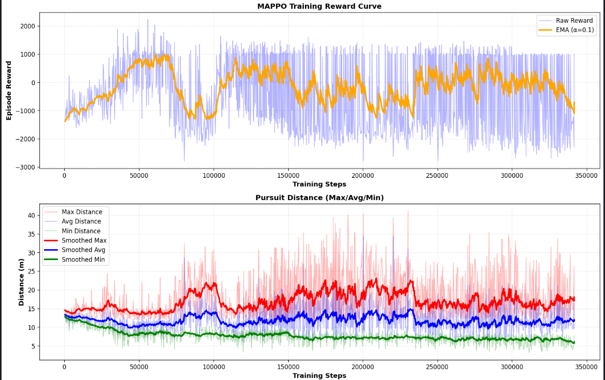
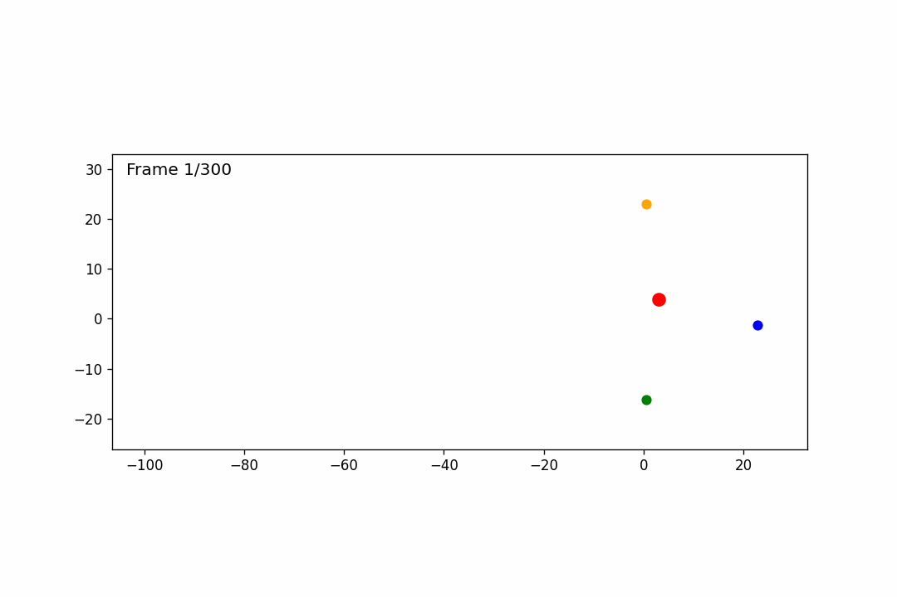

# 多无人机协同围捕强化学习项目

## 项目文件结构

### 核心代码文件

- **`drone_surround_env.py`** - 自定义Gym环境

  - 定义3v1追击包围的完整环境逻辑
  - 包含观测空间、动作空间、奖励函数设计实现课程学习（三阶段渐进式训练）
  - AirSim无人机控制接口
- **`mappo.py`** - MAPPO算法实现

  - 多智能体PPO算法核心代码
  - Actor-Critic网络架构
  - 环境包装器（MultiAgentEnvWrapper）
  - 训练循环和策略更新逻辑
- **`train.py`** - 训练主脚本

  - 启动MAPPO训练流程
  - 评估回调和课程晋级逻辑
  - 模型保存与加载
  - 训练进度可视化

### 测试与可视化

- **`test_model.py`** - 模型测试脚本

  - 加载训练好的模型
  - 运行测试回合并统计性能
  - 输出成功率、平均奖励等指标
- **`visualize_with_markers.py`** - 实时可视化工具

  - 在AirSim中显示无人机标记
  - 绘制追击者-目标连线
  - 显示队形和距离信息
  - 5Hz更新频率

### 配置文件

- **`settings.json`** - AirSim配置文件

  - SimMode、ClockSpeed、ViewMode设置
  - 4架无人机的初始位置配置

### 训练产物

- **`models/`** - 模型检查点目录

  - `mappo_best.pt` - 最佳模型
  - `mappo_checkpoint_*.pt` - 定期检查点
  - `mappo_interrupted.pt` - 中断恢复点

## 项目概述

本项目实现了一个基于强化学习的多无人机协同围捕系统。使用AirSim仿真环境，训练3架追击无人机协同包围1架逃逸目标无人机。采用MAPPO算法进行训练，实现了2D平面上的智能追捕和包围策略。

## 环境配置

### AirSim环境下载与安装

#### 预编译环境包下载

**沙漠环境（desert.zip）**：

- 百度网盘链接: https://pan.baidu.com/s/1D2U2cXxzFzMnobeKAp0HSw
- 提取码: `e64h`
- 解压后即可使用，无需重新编译

#### AirSim基础安装教程

**图文安装教程**：

- [AirSim详细安装教程（知乎）](https://zhuanlan.zhihu.com/p/618440744) - 包含Windows环境下的完整安装步骤

**详细视频教程**：

1. **AirSim基础操作与Python API接口**：

   - [视频1 - 环境配置](https://www.bilibili.com/video/BV1EV4y167Ez?t=1972.4)
   - [视频2 - Python接口调用](https://www.bilibili.com/video/BV1Ec411N7iu?t=2015.7)
2. **轨迹绘制与无人机标记**：

   - [视频3 - 轨迹可视化](https://www.bilibili.com/video/BV1qrs7ePE4h?t=85.2)
   - [视频4 - 无人机标记](https://www.bilibili.com/video/BV1gg4y1Q75A?t=1933.1)

#### 常见安装问题

 **UnrealBuildTool.exe 缺失问题**

如果在编译过程中遇到 `Missing UnrealBuildTool.exe` 错误：

- **问题原因**：VS2022的更新导致底层构建工具路径变化
- **解决方案**：可以忽略 `blocks.sln` 的编译错误
  - `build.cmd` 编译后的报错可以忽略
  - `blocks` 只是测试文件，不影响主要功能
  - 详细讨论见：https://forums.unrealengine.com/t/missing-unrealbuildtool-exe-after-build/242198

### 软件以及库的依赖

- **AirSim** + **Unreal Engine 4**：物理仿真环境
- **Python 3.11**
- **PyTorch**：深度学习框架
- **Gymnasium**：RL环境接口
- **NumPy**：数值计算
- **Matplotlib**：结果可视化

### AirSim配置

配置文件位于 `settings.json`：

- **ClockSpeed**: 100（100倍速仿真加速）
- **ViewMode**: NoDisplay（训练时关闭渲染以提升速度）
- **SimMode**: Multirotor（多旋翼无人机）
- **4架无人机**：Drone0（目标）、Drone1-3（追击者）

### 与UE交互的函数列表

#### 控制类（Python → UE）

| 函数                       | 作用                 |
| -------------------------- | -------------------- |
| `moveByVelocityZAsync()` | 发送速度控制指令     |
| `simSetVehiclePose()`    | 直接设置位置（重置） |
| `enableApiControl()`     | 让 Python 控制无人机 |
| `armDisarm()`            | 解锁/反锁无人机      |

#### 状态获取类（UE → Python）

| 函数                      | 返回内容         |
| ------------------------- | ---------------- |
| `getMultirotorState()`  | 位置、速度、姿态 |
| `simGetCollisionInfo()` | 是否碰撞         |

## 算法实现细节

### 1. 多智能体强化学习架构

本项目采用了CTDE的范式：

#### 集中式动作空间

- 虽然有3个追击无人机，但使用**单一策略网络**输出所有无人机的动作
- 输入：33维全局观察（包含所有无人机的局部观察）
- 输出：6维动作（3架无人机的2D速度）
- **优势**：策略网络可以隐式学习协作，无需显式通信机制

### 2. MAPPO算法实现

### 3. 环境设计 (`drone_surround_env.py`)

#### 状态空间（39维）

每架追击无人机观察13维信息：

- 自身2D位置 (x, y)
- 自身2D速度 (vx, vy)
- 相对目标的2D位置 (dx, dy)
- 到目标的距离 (1维)
- 两架友机的相对2D位置 (4维)
- 到边界的最近距离 (2维: x方向, y方向)

**总计：13维 × 3架 = 39维**

#### 观测归一化

为了提高神经网络训练效率，所有观测值都进行了归一化处理（在 `mappo.py`的 `_split_obs`函数中）：

| 观测维度            | 原始范围    | 归一化方法 | 归一化后范围 |
| ------------------- | ----------- | ---------- | ------------ |
| [0:2] 位置 (x, y)   | [-200, 200] | ÷ 200     | [-1, 1]      |
| [2:4] 速度 (vx, vy) | [-5, 5]     | ÷ 10      | [-0.5, 0.5]  |
| [4:6] 相对目标位置  | [-400, 400] | ÷ 200     | [-2, 2]      |
| [6] 到目标距离      | [0, 400]    | ÷ 200     | [0, 2]       |
| [7:11] 相对队友位置 | [-400, 400] | ÷ 200     | [-2, 2]      |
| [11:13] 到边界距离  | [0, 200]    | ÷ 200     | [0, 1]       |

**作用**：将不同量级的观测统一到相近的数值范围，避免某些特征主导梯度更新，加快收敛速度。

#### 动作空间（6维）

3架追击无人机的2D速度控制：

- 每架无人机：(vx, vy)
- 速度范围：[-5.0, 5.0] m/s
- 高度固定在-15m（使用 `moveByVelocityZAsync`严格2D控制）

**总计：2维 × 3架 = 6维**

#### 奖励函数

1. **环形奖励 (R_ring, 权重=15.0)**

   - 目标：鼓励在[r_min, r_max]圆环上包围（避免贴脸围殴）
   - 环中心：`ring_center = (r_min + r_max) / 2`
   - 高斯形奖励：`exp(-(dist_error / ring_width)²)`
   - 映射到 `[-1, 1]`：在环上正奖励，偏离负奖励
   - **强调距离环形，主导奖励信号**
2. **角度分散奖励 (R_shape, 权重=0.1)**

   - 目标：3个追击者角度分散（辅助作用）
   - 基于最小角度差：`(min_angle/π - 0.3)`
   - 裁剪范围：`[-1, 1]`
3. **进度奖励 (R_progress, 权重=3.0)**

   - 奖励距离改善：`previous_distance - current_distance`
   - 裁剪范围：`[-0.5, 0.5]`
   - **降低权重避免淹没ring信号**
4. **安全距离惩罚 (R_safety, 权重=0.5)**

   - 防止队友碰撞（安全距离3.5m）
   - 碰撞惩罚：`-(d_safe - d) × 2.0`
   - 裁剪范围：`[-2, 0]`

**步内奖励**：所有权重奖励求和后乘以0.2，控制在 `[-3, +3]`范围

#### 终局奖励

- **成功包围**：+1000（大幅提高以强化成功目标）
- **碰撞/出界**：-100
- **超时**：-20

#### 成功判定条件（三重验证）

我实现了严格的成功判定机制：

1. **半径条件**：所有追击者距离在所设定的圆环内
2. **角度条件**：3个追击者角度差都 > 60°（避免扎堆）
3. **持续条件**：必须连续保持若干步步才算成功（防止擦边）

#### 目标逃跑策略

- 每30步更新逃跑方向（减少API调用）
- 计算追击者中心位置，向相反方向逃跑
- 逃跑速度：根据课程阶段动态调整（0.0 / 0.25 / 0.5 / 0.5 / 0.7 / 1.0 m/s）
- 固定高度：-15m

### 4. 课程学习（Curriculum Learning）

我实现了一个**六阶段渐进式训练策略**，让模型从最简单的静止目标逐步学习到高速移动+严格角度约束的复杂任务。

#### Stage 0: 初级阶段（静止目标）

**目标**：学会基础追击和接近静止目标

- **半径范围**：[4.0m, 10.0m] （非常宽松）
- **目标速度**：0.0 m/s （完全静止）
- **成功判定**：连续保持3步，**仅要求距离**（`easy_success=True`）
- **回合长度**：350步

#### Stage 1: 进阶阶段（极慢速移动）

**目标**：学会追击极慢速移动目标

- **半径范围**：[5.0m, 9.0m] （略收窄）
- **目标速度**：0.25 m/s （极慢速移动）
- **成功判定**：连续保持4步，**仅要求距离**
- **回合长度**：400步

#### Stage 2: 中级阶段（慢速移动）

**目标**：学会追击慢速移动目标

- **半径范围**：[5.0m, 9.0m]
- **目标速度**：0.5 m/s （慢速移动）
- **成功判定**：连续保持5步，**仅要求距离**
- **回合长度**：450步

#### Stage 3: 高级阶段（引入角度约束）

**目标**：在慢速追击中开始要求角度分散

- **半径范围**：[5.0m, 8.0m] （收窄）
- **目标速度**：0.5 m/s
- **成功判定**：连续保持5步，**开始要求角度** ≥ 45°（`easy_success=False`）
- **回合长度**：500步

#### Stage 4: 挑战阶段（提速+角度）

**目标**：追击中速目标并保持角度分散

- **半径范围**：[6.0m, 8.0m]
- **目标速度**：0.7 m/s （中速移动）
- **成功判定**：连续保持6步，角度要求 ≥ 45°
- **回合长度**：550步

#### Stage 5: 终极阶段（最高难度）

**目标**：完美包围高速目标并保持120°均匀分布

- **半径范围**：[6.0m, 8.0m] （严格）
- **目标速度**：1.0 m/s （高速移动）
- **成功判定**：连续保持6步，**角度要求 ≥ 60°**（接近120°均匀分布）
- **回合长度**：600步

#### Stage 6: 超级终极阶段（极限挑战）

**目标**：在极限条件下追击并包围高速移动目标

- **半径范围**：[5.0m, 7.0m] （更严格）
- **目标速度**：2.0 m/s （极高速移动）
- **成功判定**：连续保持7步，**角度要求 ≥ 60°**（接近120°均匀分布）
- **回合长度**：650步

#### 自动晋级/降级机制（滑动窗口策略）

我实现了基于**滑动窗口**的稳健课程学习机制，避免因单次评估波动导致的频繁阶段切换：

**核心逻辑**：

- 维护一个长度为3的滑动窗口，记录当前阶段最近3次评估的成功率
- 只有当连续3次评估都在同一阶段时，才根据平均成功率做升/降级决策
- 阶段切换后立即清空历史窗口，重新积累新阶段的评估数据

**晋级条件**（平滑上升）：

```python
# 过去3次评估平均成功率 > 60%，且当前阶段 < 5
if avg_success_rate > 60.0 and current_stage < 5:
    advance_curriculum()  # Stage 0→1→2→3→4→5
```

**降级条件**（稳定性保护）：

```python
# 过去3次评估平均成功率 < 20%，且当前阶段 > 0
if avg_success_rate < 20.0 and current_stage > 0:
    degrade_curriculum()  # Stage 5→4→3→2→1→0
```

**优势**：

1. **避免噪声干扰**：单次评估波动不会触发阶段切换
2. **渐进式学习**：从简单任务逐步学习到复杂任务
3. **稳定性保护**：降级机制防止过早晋级导致的性能崩溃
4. **自适应调节**：根据学习状态自动调整任务难度

### 3. 训练脚本 (`train.py`)

#### 训练模式

采用On-Policy模式：

- 直接与环境持续交互
- 无周期性评估中断
- 策略更新更连贯

#### PPO超参数

超参数配置：

```python
    gamma: float = 0.99 # 折扣因子
    gae_lambda: float = 0.95 # GAE参数
    clip_range: float = 0.2 # PPO裁剪范围
    actor_lr: float = 3e-4  # 学习率
    critic_lr: float = 3e-4 # 学习率
    ent_coef: float = 0.005  # 熵系数
    vf_coef: float = 0.5    # 价值函数损失系数
    max_grad_norm: float = 0.5   # 梯度裁剪阈值
    batch_size: int = 512  # 每次更新的批量大小
    n_steps: int = 1024  # 每个环境运行的时间步长
    n_epochs: int = 10  # 每次更新的迭代次数
    device: str = 'cpu'   
```

#### 训练与评估分离

**训练阶段**（带探索）：

- 从策略采样随机动作
- 累积经验用于策略更新
- 每10回合记录统计（静默）

**评估阶段**（纯策略）：

- 每10000步评估20个回合
- 使用确定性动作（无噪声）
- 计算成功率、平均奖励
- 判断是否晋级课程阶段

#### 训练统计

**训练过程记录**（静默，仅画图）：

- 每10个回合记录一次数据点
- 绘制训练奖励曲线
- 保存为 `training_progress.png`

**评估统计**（每10000步）：

- 运行20个确定性评估回合（无探索噪声）
- 单行输出格式：

  ```
  🎯 Eval @ Step 50000: Reward=4018.0 | Success=100.0% | [success:5] ⭐NEW BEST!
  ```
- 显示评估奖励、成功率、终止原因分布
- 自动保存最佳模型到 `./models/best_model.zip`

#### 模型保存策略

**阶段感知的最佳模型保存机制**：

为了确保"最佳模型"始终对应训练过程中达到的最高任务难度，我实现了以下策略：

1. **首次进入更高阶段**：

   - 当智能体首次成功进入更高的curriculum阶段时，立即将当前策略保存为新的全局最佳模型
   - 记录该阶段为训练过程中达到的最高阶段（`highest_stage_achieved`）
   - 初始化该阶段的历史最优奖励（`best_reward_per_stage[stage]`）
2. **阶段内最优更新**：

   - 在该最高阶段内，仅当当前评估性能优于该阶段历史最优时才更新最佳模型
   - 避免因随机波动而频繁保存模型
3. **降级保护**：

   - 当由于训练不稳定导致阶段回退时，**不会**用较低阶段的高回报覆盖高阶段的最佳模型
   - 保证"最佳模型"始终对应于训练过程中所达到的最高任务难度

**其他保存机制**：

- **Checkpoint**：每10000步保存一次（防止训练中断）
- **Final Model**：训练结束保存

### 3. 速度优化

为了加快训练速度，我做了以下优化：

#### 硬件加速

- **ClockSpeed=100**：仿真加速100倍
- **ViewMode=NoDisplay**：训练时关闭渲染，节省GPU（评估时可改为SpringArmChase观察）
- **device='cpu'**：PPO在CPU上训练MLP更快

**评估时打开视图**：在 `settings.json`中将 `ViewMode`从 `NoDisplay`改为 `SpringArmChase`可在评估时观察无人机行为

#### 代码优化

- **去除所有sleep**：reset和step中的等待全部移除
- **减少API调用**：目标更新间隔 10步→30步
- **固定动作持续时间**：0.1秒（适配高ClockSpeed）

### 4. 可视化工具

#### 实时监控 (`visualize_with_markers.py`)

- 彩色标记：目标（红）、追击者（蓝/绿/黄）
- 距离线：追击者到目标的连线
- 三角形队形：追击者之间的连线
- 5Hz更新频率
- 支持Ctrl+C安全退出

#### 测试脚本 (`test_model.py`)

- 加载训练好的模型
- 运行测试回合
- 统计成功率、平均距离、奖励
- 显示终止原因分布

## 训练流程

### 1. 启动AirSim

- 打开Unreal Engine项目
- 确认4架无人机已加载
- 确认settings.json配置正确
- 点击Play

### 2. 开始训练

```bash
python train.py
```

### 3. 监控训练（可选）

在另一个终端运行：

```bash
python visualize_with_markers.py
```

### 4. 测试模型

```bash
python test_model.py
```

## 训练阶段分析

#### 奖励曲线分析

- 随着阶段的提升，奖励曲线出现下跌趋势，这是由于任务难度增加导致的，可以看到每次下跌之后都有回升，说明模型在更高阶段的课程中进行了不错的学习。
- 在训练约 30 万步时，奖励曲线趋于平稳，倒在了stage_4，由于调参实在要花很多时间，于是决定优化到此就先停止。

#### 训练曲线

以下是训练过程中奖励曲线的可视化：



#### 2D 动态展示

以下为训练过程中某回合中的 2D 动态展示（挑出来了一版效果比较好的示意动画）：



#### UE4 实景训练动态展示

以下为在 Unreal Engine 4 环境中训练的动态展示(完整展示可查看image\)README中的mp4文件(红色为敌人，蓝绿黄为三架追击无人机))：


#### 阶段成功率

- **Stage 4**：
  - 当前训练已达到阶段 4，成功包围率约为 60%-80%。
  - 该阶段的设定标准：
    - 半径范围：5.0 ~ 7.0。
    - 目标速度：2.0。
    - 成功阈值：5。
    - 最大步数：550。
    - 最小角度差：75°。

目前算法框架已搭建完善，且训练出部分模型结果，持续优化中

## 目前的项目总结与下一步计划

### 已完成的工作

- 搭建完整的 3v1 协同围捕 AirSim 环境
- 完成全 39 维状态与 6 维动作空间设计
- 实现完整奖励体系与成功判定机制
- 构建 7 阶段 Curriculum Learning
- 编写 MAPPO 算法（Actor-Critic、GAE、PPO Loss）
- 完成训练框架（评估、保存、绘图、Logging）
- 已成功训练多个阶段，策略可实现稳定围捕行为

### 成功策略能力

- 稳定维持目标半径范围
- 学习保持三无人机队形
- 对高速目标也能维持基本围捕
- 避免追击者间相互碰撞
- 角度约束逐步形成均匀分布

### 下一步计划

## - 提升高难度阶段成功率（Stage 5-6）

- 优化角度奖励，增加协同行为的稳定性
- 训练更强鲁棒性策略（加入目标随机加速/急转弯）
- 将模型迁移到真实无人机平台进行初步测试（长期目标）

#### 最后于更新：2025年11月18日
